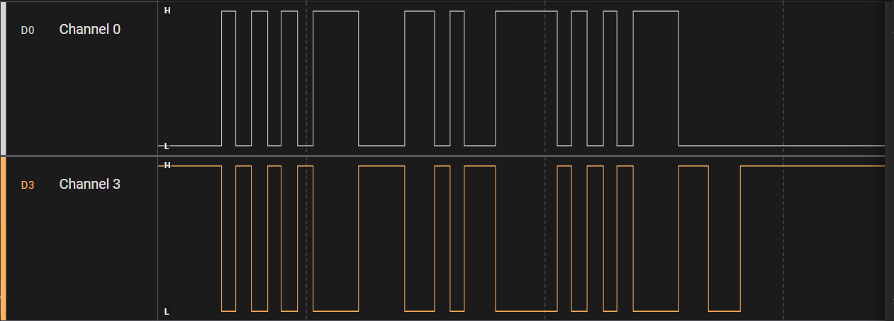

# What is validated, and how

Evidence, not argument. Why the design is shaped the way it is lives in
`docs/writeup.md` and `docs/row-format-decision.md`; this file records only
what has been shown, by what means, and what has not.

**This is a living file.** Rows move from *Not validated* upward as evidence
arrives. **The method column is never upgraded without a new artifact** — a
claim does not become `hardware` because hardware would obviously agree, and
it does not become `formal` because a test passes. If the artifact named in a
row cannot be run, the row is wrong and should move down.

`method` is one of exactly:

| | |
|---|---|
| `hardware` | ran on a Digilent Cora Z7-07S |
| `simulation` | Python models and/or RTL testbenches only |
| `formal` | proved by SymbiYosys |
| `gate-level` | post-synthesis or SDF-annotated netlist |
| `signoff` | LibreLane DRC / LVS / STA on the hardened design |

## How to read the hardware rows

**No instrument capture is stored in this repository.** The hardware rows are
reproducible as a *procedure* — regenerate the ROM, rebuild the bitstream,
flash, observe — and the outcome was read off the board by the operator. There
is no scope trace, logic-analyser capture or serial log committed anywhere, so
a reader cannot re-derive these from the repo alone the way they can the other
four methods. Dates are when the result was reported, anchored to the commit
that carried the code, not a timestamp from an instrument.

That is a real weakness in this table and it is stated rather than hidden. The
fix, when it matters, is to capture something — a terminal log for UART, a
counter read back over the host port — and commit it.

---

# Validated

## hardware

| claim | evidence | date |
|---|---|---|
| The loader brings the chip up from reset with no host: program, configuration and pin-assignment chains, then `run`. One machine. | `python3 scripts/gen_fpga_rom.py --program blink --div 8 -o rtl2/stt_rom.vh`, build, flash; the LED blinks at 1.00 Hz (P = 65535, counter reload 119). Simulated first by `rtl2/tb/tb_fpga_blink.v`. Code: `5891182` | 2026-09-20 |
| A machine drives a pin through the iomux on a live clock, at a rate set by the timer. | Same as above — the blink IS the timer and the pin path. | 2026-09-20 |
| UART TX at 9600 baud into a CP2102 USB-TTL adapter, framing correct against hardware nobody here wrote. | `--program uart_tx --div 8`; P = 1628, 9597.67 baud (−0.0243%), `0x55` continuous on `uo_out[0]`. Simulated first by `rtl2/tb/tb_fpga_uart.v`. Code: `9701b13` | 2026-09-21 |
| UART TX into UART RX on two machines, both wiring routes: internal, and through a jumper across real pads. Exercises `STT_NSM = 2`, the loader walking two machines, the 74-bit pin chain, and the §8.3 input synchronizer. | `--program loopback --nsm 2 --div 8`; byte `0x47`; LED toggles once per 256 correct bytes via `stt_hostread.v` reading machine 1's RX FIFO over §11.2. Simulated first by `rtl2/tb/tb_fpga_loopback.v`. Code: `e5eff5b` | 2026-09-21 |
| USB LS token TX into token RX on two machines, both routes. First physical exercise of the **pair slot** (§7 code 3), **NRZI** both directions, the **self-loopback through a `uio` pin**, and the §11.2 host **write** path. | `--program usb_loopback --nsm 2 --div 8`; P = 10 (1.5625 Mbit/s), token PID `0x2D` field `0x03A` CRC5 `0x16`. Simulated first by `rtl2/tb/tb_fpga_usb.v`. Code: `9116bf6` | 2026-09-23 |
| A machine can read its own output back through a `uio` pad, with no board wire. | `tb_fpga_usb.v` asserts `uio_oe[1] = 1` and the decode works; confirmed on hardware by the USB row above. This is what makes the USB receiver something the ASIC could run. | 2026-09-23 |
| **D+ and D− are genuinely complementary, and end the packet in SE0.** Both halves transition together throughout, and both go low at the end. | Saleae Logic at 12 MS/s on the running `usb_loopback` bitstream, `STT_NSM=2`, `LOOPBACK_INTERNAL=0`, external JA1→JB1 jumper. D+ on JA1, D− on JA2 (analyzer channels D0 and D3).  `docs/img/usb-pair-la.png` | 2026-09-25 |
| **The inter-packet idle gap is real and visible**, not just a model requirement: a packet burst followed by a long quiet interval. | Same capture. The receiver's end-of-packet rule is a run of ones longer than stuffing permits, so the gap is what lets it resync (`SPEC.md` §16.2). | 2026-09-25 |
| **The bit period is in the USB low-speed region**, measured on the wire rather than inferred from the configuration. | Same capture: 667 ns reported per bit. **Read this with its resolution.** At 12 MS/s one sample is 83.33 ns, so a single bit interval is resolved to ±13%, and 667 ns is exactly 8 samples. The configured period is **640 ns** — P = 10 at 15.625 MHz, 1.5625 Mbps — and the capture cannot distinguish 640 ns from 667 ns. What it establishes is the order: sub-microsecond bits at roughly USB LS rate. It does **not** establish 1.5 Mbps; see the *not validated* row below. | 2026-09-25 |

## signoff

All from `floorplan/runs/RUN_2026-09-18_00-21-34`, five machines, format D,
top `tt_um_stt`. **The run directory is gitignored** (`floorplan/runs/`), so
the artifact is the flow, not a committed report: `floorplan/run.sh`, with
`floorplan/gen_config.py` for the configuration.

| claim | evidence | date |
|---|---|---|
| Zero DRC, three independent checkers | `final/metrics.json`: `magic__drc_error__count` 0, `klayout__drc_error__count` 0, `route__drc_errors` 0 | 2026-09-18 |
| Zero LVS errors | `design__lvs_error__count` 0 | 2026-09-18 |
| Zero antenna violations | `antenna__violating__nets` 0, `antenna__violating__pins` 0 | 2026-09-18 |
| 59.35% instance utilization at five machines | `design__instance__utilization` 0.593477 | 2026-09-18 |
| Setup −2.1997 ns at the slow corner; hold met at every corner | `timing__setup__ws__corner:nom_slow_1p08V_125C` −2.1996929, `timing__hold__ws` +0.108 (fast) | 2026-09-18 |
| Worst-case IR drop 0.02% on both power nets | **Not from the run above** — that run logs `Skipping step 'IR Drop Report'`. From sibling runs `RUN_2026-09-18_00-08-09`, `_00-56-22` and `RUN_2026-09-19_12-33-14`, which report `Worstcase IR drop: 1.92e-04 V` on the power net and `2.39e-04 V` on ground, both 0.02%. Those runs match the signed-off one on setup WS (−2.1996929), utilization (0.593477) and LVS (0), so it is the same configuration — but it is a **different run**, and the distinction is recorded because conflating runs is a mistake this project has already made (`writeup.md` §4.3 entry 8). | 2026-09-18 |

## gate-level

| claim | evidence | date |
|---|---|---|
| Inter-pin skew, SDF back-annotated on the signed-off netlist, both corners, every pair separately. Worst 0.707 ns at the slow corner. | `cd rtl2 && python3 tb/run_skew.py typ slow`, via `rtl2/sdf/prep_sdf.py`. Numbers and per-pair table in `docs/skew-report.md`. | 2026-09-19 |
| The measurement instrument can represent a non-zero answer — clock-to-output 2660–3367 ps slow, 1636–2087 ps typ, and `test_skew.py` fails if any pin reads zero. | `rtl2/tb/test_skew.py`; the assertion is in the file. | 2026-09-19 |
| Formal code does not reach synthesis: no `$assert`, `$assume`, `$anyseq`, `$anyconst`, `$live` or `$cover` cells in the production netlist. | `rtl2/formal/check_synth_clean.sh`, run by `make formal` | 2026-09-19 |
| The instruction memory holds what was shifted into it, through the TT boundary with the CFGMEM macros. | `make rtl2-imemload` (`rtl2/tb/test_imemload.py`), five programs | 2026-09-19 |

## formal

Engine is `abc pdr` (IC3), unbounded except where noted. **Every property
ships with a deliberate break that must fail**, and `rtl2/formal/run_formal.sh`
fails if a break passes. 32 tasks, listed in `rtl2/formal/tasks.txt`.

| claim | evidence | date |
|---|---|---|
| P1 — the branch resolver agrees with SPEC §5 for every mode, target, row and test outcome | `make formal`, tasks `p1`; breaks `p1_break_ret`, `p1_break_skip` | 2026-09-19 |
| P2 — action groups are mutually exclusive for every one of the 2³² row words | task `p2`; break `p2_break` | 2026-09-19 |
| P3 — every row word decodes to defined behaviour: in-range selects, unassigned test codes never pass, one slot written, no-ops write nothing, a non-firing row changes no state | tasks `p3_a`…`p3_e`; breaks `p3_b_break`…`p3_e_break` | 2026-09-19 |
| P4 — a FIFO's flags always match what it holds; overflow and underflow are no-ops; sticky flags never clear | tasks `p4_a`…`p4_d`; breaks `p4_break_full`, `p4_break_ovwr`, `p4_break_sticky` | 2026-09-19 |
| P5 — the timer is true on exactly one cycle in P: **PROVED for every P at `TIMER_W = 8`**, **BOUNDED to depth 80 at the real `TIMER_W = 16`** | tasks `p5_lemma`, `p5_a_w8`, `p5_b_w8`, `p5_c` (proved), `p5_a_bmc`, `p5_b_bmc` (bounded); breaks `p5_break_fire`, `p5_break_wrap`, `p5_break_period` | 2026-09-19 |

## simulation

`make check` runs all of these and exits non-zero on any failure.

| claim | evidence | date |
|---|---|---|
| The encoding is consistent across `spec/isa.json`, `isa_bench/`, `docs/SPEC.md` and `rtl2/stt_isa.vh` | `make spec-check`, `make rtl2-isa-check`: 60 encoding entries, 17 generated blocks | continuous |
| The encoding freeze holds — six programs, 84 rows, every packed word unchanged | `make check-freeze` (`isa_bench/freeze_check.py` against `golden_words.json`) | continuous |
| No inferred latches, in `rtl2` and up to `tt_um_stt` | `make rtl2-latch`, `make rtl2-latch-tt` | continuous |
| Mutation kill rate 89.1% over 350 mutants, gated at 85% and at the mutant count | `make check-mutation` (`isa_bench/mutate.py --gate`) | continuous |
| CAN 2.0A TX decodes against an independent CRC-15, and its receiver rejects corrupted frames | `make check-can` | continuous |
| The pin-assignment builder rejects six classes of unusable assignment **and accepts valid ones** | `make check-pinmap` | continuous |
| Configuration outside its stated range is rejected at construction, and every range edge accepted | `make check-config` (`isa_bench/config_check.py`) | continuous |
| The generated FPGA ROM matches the widths the RTL computes for its own shift registers | `make check-fpga-rom` (`scripts/check_fpga_rom.py`), with a self-test that a 5-bit mismatch is caught | continuous |
| `uart_rx` decodes at all 16 phases and tolerates ±8 cycles of jitter in a 32-cycle bit | `make check-phase` | continuous |
| USB LS receive decodes the reference transmitter, four packets including the all-ones field that forces stuffing; works at bit periods 9–32 | `make check-usb-rx` (`isa_bench/usb_rx_check.py`) | 2026-09-22 |
| Cycle-exact RTL-vs-model lockstep on every architectural register and FIFO operation; random programs; RTL mutation; the chip boundary at five machines | `make rtl2-full` — **not part of `make check`**; needs cocotb and a simulator | continuous |
| Program sizes against the 32-row ceiling: uart_tx 5, uart_rx 8, spi 8, i²c 22, usb_tx 16, **usb_rx 24**, jtag 25, can 24 | built and counted from `isa_bench/programs.py`, `jtag_prog.py`, `can_prog.py` | 2026-09-22 |

---

# Not validated

Each entry says what is missing, not why it is acceptable.

| claim | what exists | what is missing |
|---|---|---|
| **SPI against a real device** | `bench.run_spi` against `devices.SpiTarget`, a model written here | Never run against a real SPI peripheral, and never on hardware in any form |
| **I²C against a real device** | `bench.run_i2c` against `devices.I2cTarget`, including clock stretching | Same — model only, no hardware |
| **CAN against a real device** | `make check-can`: TX decoded by an independent CRC-15, RX rejects corrupted frames | Model only. CAN has never run on hardware, which also means its destuffing — the case §16.0 says is expensive — has no physical evidence |
| **`crc_lfsr16` and `bit_stuffer`** | Implemented, reachable through §9's reserved codes, exercised in simulation | **Never run on any hardware, in any form.** The USB work did not change this: the token uses the 5-bit per-machine CRC, and the receiver destuffs with the `c2` countdown, not the unit |
| **Exact USB low-speed rate (1.5 Mbps)** | The pair, NRZI, SE0 and an approximately-LS bit period are confirmed on a trace (above) | The design is configured at **1.5625 Mbps**, which is **+4.17%** against the 1.5 Mbps the standard specifies — and at 15.625 MHz no integer timer period hits 1.5 Mbps exactly (15.625 / 1.5 = 10.4167). The 12 MS/s capture resolves a single bit to ±13% and cannot tell the two apart. Nothing here has been checked against a real USB host or device, and +4.17% would be outside low-speed tolerance if it were |
| **Pair symmetry under fault** | The trace shows the pair complementary in normal operation, and `rtl2/tb/tb_fpga_usb.v` asserts it cycle by cycle in simulation | No negative case on hardware: a bitstream with a deliberate pair-slot fault has not been built and captured, so the trace shows the good case only |
| **More than two machines on hardware** | `STT_NSM = 2` has run; the signed-off ASIC design is five | Three, four and five machines have never been configured on the FPGA. The loader's per-machine walk is exercised at 2, not 5 |
| **Input-side setup and hold as a margin** | The UART and USB loopbacks prove inputs are sampled correctly at their bit rates | No measured number. Whether a pin a machine *reads* meets setup at the first synchronizer flop under real cell and routing delay is unmeasured; `docs/skew-report.md` §4 records it as not attempted. The loopbacks show it works, not by how much |
| **Inter-pin skew on inputs** | Output-to-output skew measured, both corners (`docs/skew-report.md`) | The input side is output-only in every measurement so far |
| **Timing closure at 50 MHz** | Setup is −2.1997 ns at the slow corner, so ~45 MHz | The TT template target is 50 MHz and this does not meet it. Recorded in `SPEC.md` §16 |
| **Max slew, capacitance and fanout** | Counted: 48 slew, 13 cap, 622 fanout violations at signoff | Not clean, and not closed. The counts above are from `final/metrics.json`. The split attributed in `writeup.md` §5 -- 320 of the fanout violations inside the vendored CFGMEM macro, 302 outside it -- is NOT re-verified here; only the 622 total is |
| **The ASIC itself** | Hardened, signed off, GDS produced | **Not fabricated.** Every `hardware` row above is FPGA. Nothing in this project has run on the taped-out part, because there is no taped-out part |
| **USB receive CRC5 checking in-program** | The CRC arrives as data in byte 3 and the host checks it | No test code reads the CRC register (§16.0), so the receiver cannot reach a verdict itself |
| **Host-attested hardware results** | The procedures in the `hardware` table above | No captured artifact — see *How to read the hardware rows* |
